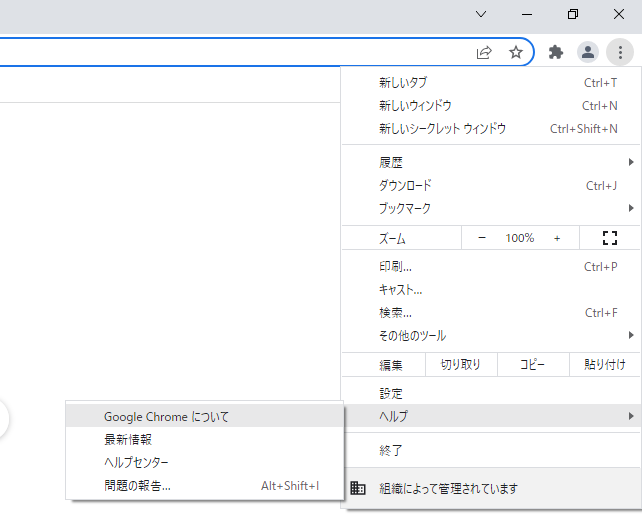
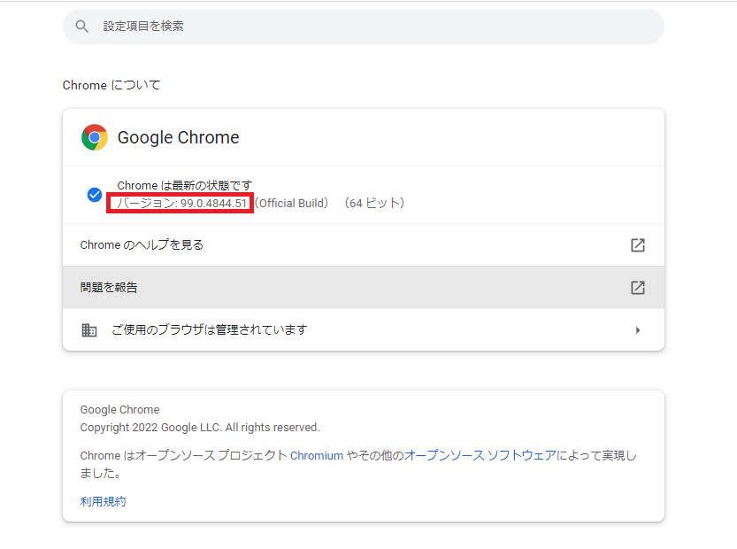

# インストール
## Chrome Driver
1. google chromeのバージョンを確認する

2. https://chromedriver.chromium.org/downloads にアクセスし、対応したバージョンのzipファイルをダウンロードする

3. ダウンロードしたファイルを解凍し、chromedriver.exdを任意の場所に保存する

## Selenium
1. コマンドプロンプトを開く

2. `pip install selenium` を実行する

## Python
1. https://www.python.org/ にアクセスし、インストーラーをダウンロード(本環境は3.10.0)

# 顧客データの準備
1. customer_info.xlsxを参考にファイルを作成(体裁,ファイル場所は変更しないこと)

2. main.pyの14行目`url`は環境によって適宜変更する

3. main.pyの17行目`driver`はインストール時にchromedriver.exeを配置したファイル場所に変更する

4. main.pyの20行目`image_file`は本人確認書類の画像であり、適当な画像にする

5. main.pyの22行目`book`は1で作成したエクセルファイルにする

6. `python main.py` を実行
